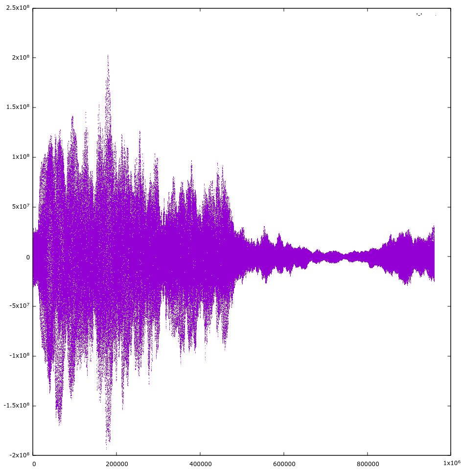

<div align="center">

<h1>Vidify Audiosync</h1>
<span>Extension for <a href="https://github.com/vidify/vidify">Vidify</a> to <b>synchronize</b> the audio from <b>YouTube</b> and what's <b>playing on your computer</b>.</span>

<a href="https://github.com/vidify/audiosync/actions"></a> <a href="https://pypi.org/project/vidify-audiosync/"></a> <a href="https://aur.archlinux.org/packages/vidify-audiosync/"></a>

<a href="images/demo.mp4"></img></a>

</div>

## Installation
Audiosync is currently only available on Linux. The requirements are:

* [pulseaudio](https://www.freedesktop.org/wiki/Software/PulseAudio/) and libpulse.
* [ffmpeg](https://www.ffmpeg.org/) (must be available in the user's path): a software suite to both download the song and record the system's audio.
* [FFTW](http://www.fftw.org/): the fastest library to compute the discrete Fourier Transform (DFT), which is the most resource-heavy calculation made in this module.

You can install the module with pip: `pip3 install vidify-audiosync --user`.

It's also available on the AUR for Arch Linux users as [`vidify-audiosync`](https://aur.archlinux.org/packages/vidify-audiosync/).
And in the [GURU overlay](https://wiki.gentoo.org/wiki/Project:GURU) for Gentoo Linux users as [media-video/vidify-audiosync](https://gpo.zugaina.org/media-video/vidify-audiosync): `eselect repository enable guru && emerge --sync guru && emerge vidify-audiosync`


## Usage
This README is a guide oriented for developing. Please check out the [Vidify guide](https://github.com/vidify/vidify#audio-synchronization) for more information about how to use it with Vidify.

Audiosync's main function is `audiosync.run(title: str) -> int, bool`. It will return the displacement between the two audio sources (positive or negative), which will only be valid if the returned boolean is true. `title` is the track's title to search for in YouTube.

After this function has been called, its progress can be monitored and controlled with other exported functions. Here's a brief description for all of them:

* `audiosync.status() -> str`: returns the current job's status as a string.
* `audiosync.resume() -> None`: continue the audiosync job. This has no effect if it's not paused.
* `audiosync.pause() -> None`: pause the audiosync job.
* `audiosync.abort() -> None`: abort the audiosync job.
* `audiosync.setup(stream_name: str) -> None`: attempts to initialize a dedicated PulseAudio sink to record more easily the audio directly from the music player stream.
* `audiosync.get_debug() -> bool`: obtain the current logging level
* `audiosync.set_debug(do_debug: bool) -> None`: configure the logging level

This interface is also available from the C library. You can read more details about these exported functions in the [include/audiosync.h header](https://github.com/vidify/audiosync/blob/master/include/audiosync/audiosync.h), and its implementation in [src/audiosync.c](https://github.com/vidify/audiosync/blob/master/src/audiosync.c).

There are 2 apps to try:

* `apps/main.c`: used to debug more easily with C. You can run it with:

```shell
mkdir build
cd build
mkdir images
cmake ..
make -j4
./apps/main "SONG NAME"
```

* `apps/main.py`: equivalent to `apps/main.c`, but in Python. You can simply use `python main.py "SONG NAME"`.


## How it works
*I'll try to explain it as clearly as possible, since this took me a lot of effort to understand without prior knowledge about the mathematics behind it. If someone with a better understanding of the calculations performed in this module considers that the explanation could be improved, please [create an issue](https://github.com/marioortizmanero/vidify-audiosync/issues) to let me know.*

The algorithm inside [src/cross\_correlation.c](https://github.com/marioortizmanero/vidify-audiosync/blob/master/src/cross_correlation.c) calculates the lag between the audio sources (a [cross-correlation](https://en.wikipedia.org/wiki/Cross-correlation)). This is used in many mathematical disciplines for different purposes, including [signal processing](https://en.wikipedia.org/wiki/Cross-correlation#Time_delay_analysis). The cross-correlation function describes the points in time where the signals are best aligned:



The graph above indicates that the provided signals are most likely to be aligned at the maximum point (at about ~18,000 frames, taking the absolute value of the function). There are many different ways to calculate the cross-correlation of two signals. In this case, precision is sacrificed for speed, because it's going to be calculated multiple times at real-time for fairly big samples (up to ~1,440,000 frames).The [Discrete Fourier Transform](https://en.wikipedia.org/wiki/Fast_Fourier_transform) is vital in the used method, which determines the frequency content of the signal.

Let `rfft` be the [Fast Fourier Transform](https://en.wikipedia.org/wiki/Fast_Fourier_transform) (an algorithm to calculate the DFT) in the real domain, `irfft` the Inverse Fast Fourier Transform in the real domain, and `conj` the conjugate of the imaginary results from the FFT, the formula is:

`irfft(rfft(source) * conj(rfft(sample)))`

There are two different audio tracks: the source, and the sample. In this case, the source is the downloaded YouTube audio, and the sample is the recorded audio. Thus, the results will indicate the sample's delay in respect to the source. This is because in Vidify, the offset has to be applied to the music video, which started playing as soon as the new song was detected, and has the same delay as the desktop audio.

Because it's unknown which track is the one that's delayed, a [circular cross-correlation](https://en.wikipedia.org/wiki/Discrete_Fourier_transform#Circular_convolution_theorem_and_cross-correlation_theorem) has to be performed, rather than a regular cross-correlation. So before applying the formula, one of the signals is filled with zeroes to size 2\*N. In this case, the sample is the one filled with zeroes, because it's the one that takes the most to be obtained, since it has to be recorded in real-time. The downloaded audio is usually completed before recording the full interval.

After calculating the cross-correlation, a coefficient is needed to determine how accurate the obtained results are, since the provided tracks could be different, in which case no displacement should be applied. The [Pearson correlation coefficient](https://en.wikipedia.org/wiki/Pearson_correlation_coefficient#For_a_sample) will return a value between -1 and 1, where 1 is total positive linear correlation, 0 is no linear correlation, and −1 is total negative linear correlation. The function calculates is the positive linear correlation, so the closer this coefficient is to 1, the more accurately the signals are aligned. Knowing this, the module will return the first value that exceeds `MIN_CONFIDENCE`, declared in the [audiosync.h](https://github.com/vidify/audiosync/blob/master/include/audiosync/audiosync.h) file.

Before applying the coefficient formula, both tracks have to be aligned with the result obtained from the cross correlation. There are many different ways to align the tracks, discussed [here](https://github.com/vidify/audiosync/issues/6) in detail. The current method shifts the sample track, and cuts the useless parts of the array filled with zeroes. While this can both improve performance, and obtain more accurate results, it might result in incorrect coefficients due to the result's size being too small. Do note that the alignment isn't actually performed, the Pearson Coefficient is just calculated with two offsets to avoid calling `memmove` (see [#30](https://github.com/vidify/audiosync/issues/30) for more).

Finally, the module will return the lag between the two audio sources if it's confident enough, or otherwise 0.

Another important part of the module is the concurrency. Both audio tracks have to be continuously downloaded and recorded while the algorithm is running every N seconds. This means that there are 3 main threads in this program:

* The main thread: launches and controls the download and capture threads, and runs the algorithm.
* The download thread: downloads the song with ffmpeg.
* The audio capture thread: records the desktop audio with ffmpeg.

To keep this module somewhat real-time, the algorithm is run in intervals. After one of the threads has successfully obtained the data in the current interval, it sends a signal to the main thread, which is waiting until both threads are done with it. When both signals are recevied, the algorithm is run. If the results obtained are good enough (they have a confidence higher than `MIN_CONFIDENCE`), the main thread sets a variable that indicates the rest of the threads to stop, so that it can return the obtained value. Otherwise, it continues to the next interval.


## Developing
You can run the project's tests with:

```
mkdir build && cd build
cmake .. -DBUILD_TESTING=YES
make
make test
```

Use `export CFLAGS="-DPLOT=YES` to enable debugging and save plots into the images directory. You'll need `gnuplot` installed for that, and a directory named `images`. `-DCMAKE_BUILD_TYPE=Debug` enables Address Sanitizer and more helpful [debug flags](https://github.com/vidify/audiosync/blob/master/CMakeLists.txt).

It's recommended to use Docker to run it in a containerized environment. A simple usage example would be `sudo docker build -t audiosync . && sudo docker run -t audiosync`.

Feel free to open up an issue or PR in case you have problems with the module or want to contribute. Do take in mind that this project's current status is still very early, so it's not too stable.

Documentation links:

* PulseAudio: [reference](https://freedesktop.org/software/pulseaudio/doxygen/index.html), [docs](https://www.freedesktop.org/wiki/Software/PulseAudio/Documentation/User/), [guide](https://gavv.github.io/articles/pulseaudio-under-the-hood/#portability).
